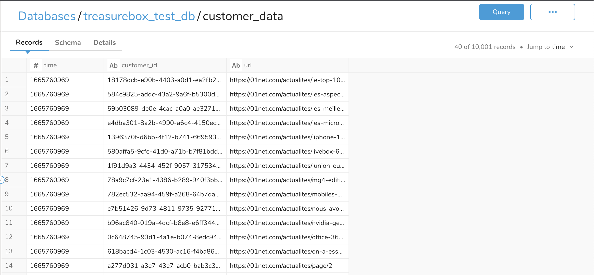
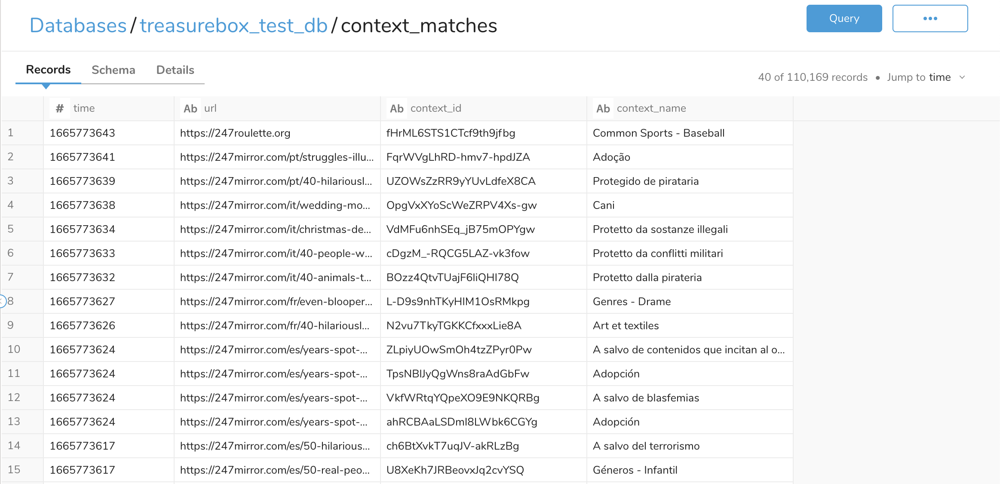

# 4D Treasurebox

The 4D Treasurebox is an encapsulated Treasure Data - 4D integration which allows Treasure Data customers to leverage 4D’s advanced semantic classification to analyze digital content in media, and return back to Treasure Data the most relevant contextual ‘Topics’ associated with them.

Topics are a targeting entity that help you build a context faster. Topics are available across verticals like fashion, music, food, and pharmaceuticals.

Use the 4D Treasurebox to:
- Enrich your data and drive better outcomes

- Customize & enhance your targeting and brand safety contextual strategies

- Increase targeting precision

- Drive outcomes and boost performance with contextual intelligence used to inform SEO, Social, OOH

## Web tracking
The 4D treasurebox needs URL data captured from media associated to customer profiles. To collect this data web tracking in the media will need to be setup via Javascript SDK, pixel tracking, or through the postback API.

See the link below for the Treasure Data documentation about web tracking using the Treasure Data JavaScript SDK and Postback API

https://docs.treasuredata.com/display/public/PD/Introduction+to+Web+Tracking

Below is an example of the pixel tracking event which can be added to media to track page URLs

<sup><sub>Note: the page_url should be replaced with an appropriate macro.</sup></sub>

```
var track 		= new Image();
td_write_key 	= {TD_WRITE_KEY};
page_url		= document.URL;

track.src="https://in.treasuredata.com/postback/v3/event/{TD_DB}/{TD_TABLE}?td_format=pixel&td_write_key="+ td_write_key + "&page_url=" + page_url;
```

## Configuration
#### Initial table
Using the Treasure Data Postback API for web tracking, an initial table should be set up with columns for both the customer identifier and URLs. 


<sup><sub>Note. The customer IDs in the example above are just UUIDs</sub></sup>

#### Setting up workflow environment secrets

Setup the following environment variables in the Treasure Data console as shown in the link below.

https://docs.treasuredata.com/display/public/PD/Setting+Workflow+Secrets+from+TD+Console

The required environment variables for the 4D Treasurebox are listed below.

| ENV Variable      | Type                     | Description                                                                                        |
| :---------------- | :----------------------- | :------------------------------------------------------------------------------------------------- |
| `TD_MASTER_KEY`   | `string`                 | Treasure Data master key                                                                           |
| `TD_ACCESS_KEY`   | `string`                 | Treasure Data access key                                                                           |
| `FOURD_USERNAME`  | `string`                 | Email of 4D account                                                                                |
| `FOURD_PASSWORD`  | `string`                 | Password for 4D account                                                                            |
| `TD_DB_NAME`      | `string`                 | Database containing original data. This will also be the database where 4D Topics will be returned |
| `TD_TABLE`        | `string`                 | Table containing original data.                                                                    |
| `TD_COLUMN`       | `string`                 | Column in table containing URLs to be processed.                                                   |
| `FOURD_CHANNEL`   | `string`                 | Associated channel in 4D.                                                                          |
| `FOURD_REGION`    | `string ('eu' or 'usa')` | Selected region for 4D.                                                                            |
| `TD_STATUS_TABLE` | `string`                 | The name of the status table required to track 4D processing.                                      |
| `TD_NEW_TABLE`    | `string`                 | New table containing URLs, context IDs and context names.                                                  |

### Setting up a channel in 4D
1. Login to 4D
2. Visit the settings page
3. Select the channels section
4. Select the 4D Treasure data channel
5. Select Add New Seat
6. Give the seat a name
7. Add a Seat-ID. This should be your Treasure Data account ID
8. Click save

### Building custom contexts
By default the integration will return all matching contexts from our standard IAB aligned taxonomy. If you want to create custom contexts outside of the taxonomy you can use the context builder to add them to your account and they will begin to be returned when enriching new data.


## Using the data
The 4D enriched data will be returned to the new table identified in the configuration. Each URL will be added with multiple related contexts.



The 4D Topics produced can be used in any way desired however here are some example queries illustrating what can be done.

1. The first example shows how the new enriched table can be joined to the users (`customer_id`) column in the original table

```
SELECT
    customer_data.customer_id,
    customer_data.url,
    context_matches.context_id,
    context_matches.context_name
FROM
    context_matches
LEFT JOIN
    customer_data
ON
    context_matches.url=customer_data.url
```

This data can then be joined to a user profile table should that already exist.

2. This example shows how to find the most common 4D Topics

```
SELECT
  context_name,
  COUNT(context_name) AS "frequency"
FROM
  context_matches
GROUP BY
  context_name
ORDER BY
  "frequency" DESC
LIMIT 25;
```
